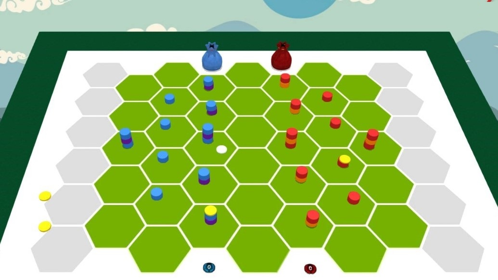

# Ultima-Tek

*Ultima-Tek* is a turn-based board game inspired by the *Ultimate* team sport played with a flying disc: throw the disc, move your pieces, bluff and surprise your opponent with bonus / penalty effects!

*Ultima-Tek*  is a game for 2 players that requires tactical and strategic thinking, while providing fun thanks to a dose of chance and bluff on the bonus / penalty effects. Children can easily play it, in particular by giving them an advantage over their number of bonuses / penalties.

A first version of the material is already created under Tabletopia platform and already available for test. The rulebook is drafted with the basic game-play (only in French right now; sorry about that).

This is a work in progress. Do not hesitate to contact me in order to test, work the rules or the theme ... or even publish it !

If you intent to derive or to sell either a text, a product or a software from this work, then read the [**LICENSE**](./docs/LICENSE.md) document. 
